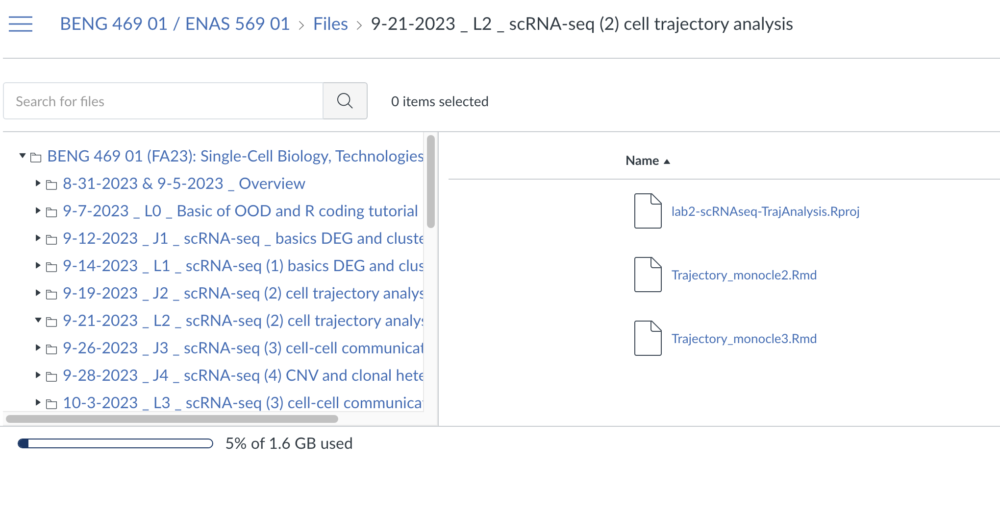
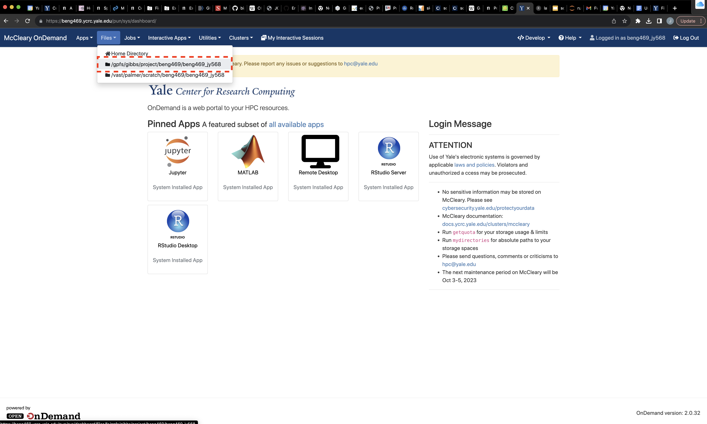
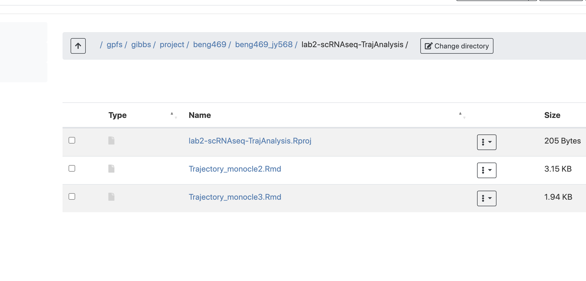
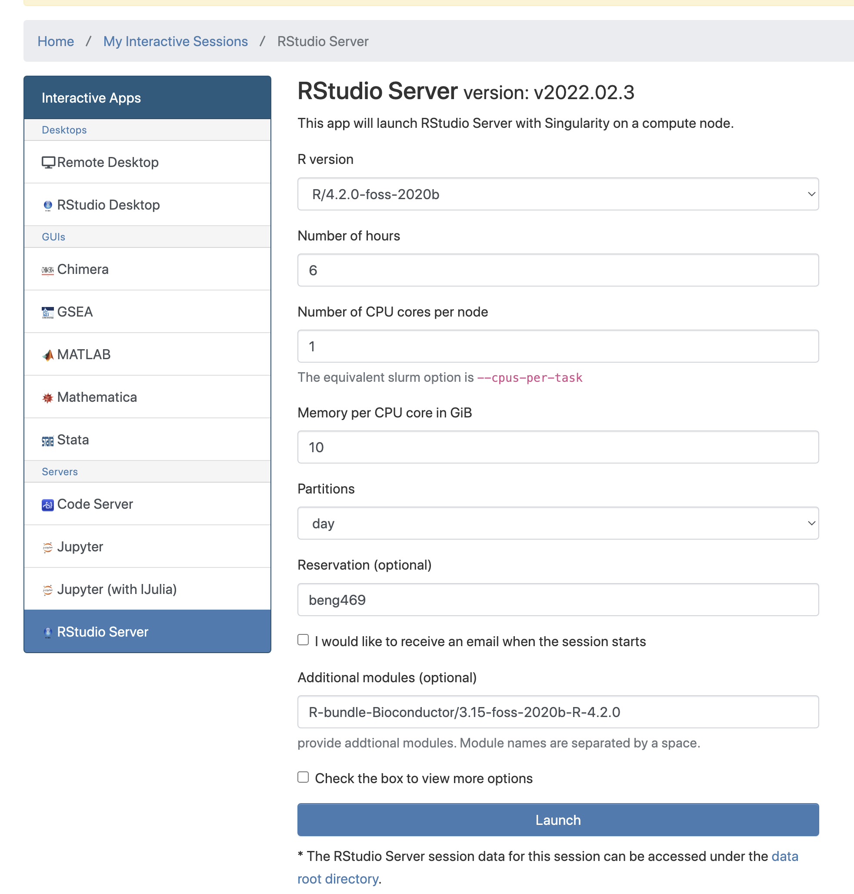
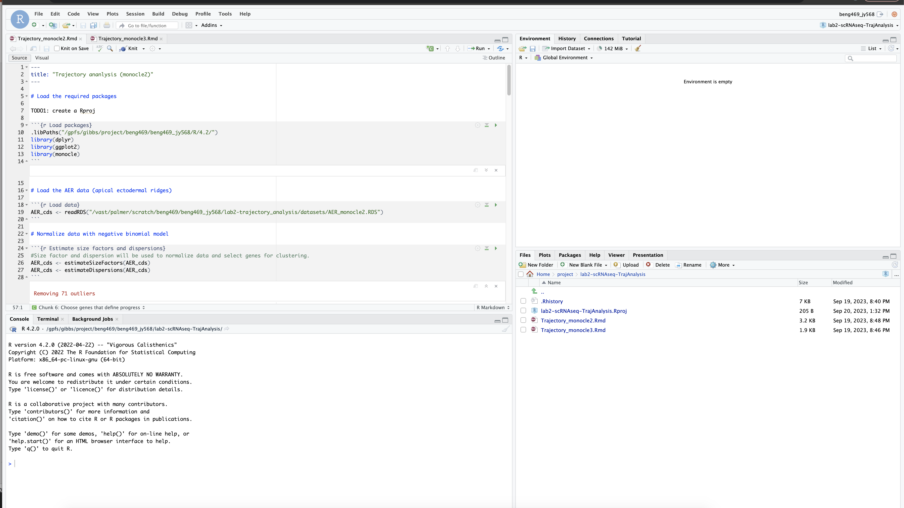

# BENG 469 Lab session 2 - instructions

## Pre-lab task: 
(Estimated completion time: 5 mins)

1. Download "lab2-scRNAseq-TrajAnalysis.Rproj", "Trajectory_monocle2.Rmd", and "Trajectory_monocle3.Rmd" under 9-21-2023_L2_scRNA-seq(2)cell trajectory analysis/ from Files on Canvas.

2. Upload the files to your project folder on HPC:

Open McCleary OnDemand at beng469.ycrc.yale.edu in a browser window, and go to Files menu and click open your project folder (/gpfs/gibbs/project/beng469/beng469_YourNetID). Then create a new directory called "lab2-scRNAseq-TrajAnalysis" and upload the files ("lab2-scRNAseq-TrajAnalysis.Rproj", "Trajectory_monocle2.Rmd", and "Trajectory_monocle3.Rmd") under this new directory.

## During the lab session (Thursday):

1. Launch an Rstudio-server session:

Go to the Rstudio-server initialization page, and specify the parameters/resources as follows:

| Parameters      | Values |
| ----------- | ----------- |
| R version      | R/4.2.0-foss-2020b       |
| Number of hours   | 6        |
| Number of CPU cores per node   | 1        |
| Memory per CPU core in GiB   | 10       |
| Partitions   | day        |
| Reservation (optional)   | beng469        |
| Additional modules (optional)  | R-bundle-Bioconductor/3.15-foss-2020b-R-4.2.0   |

Then click Launch to launch an Rstudio session, and connect the Rstudio session once it’s started

2. Open the R project and markdown tutorial:

Once you are inside Rstudio, use the file navigation panel at the bottom right to click open your project/ folder then the lab2-scRNAseq-TrajAnalysis/ folder you created, then click the “lab2-scRNAseq-TrajAnalysis.Rproj” file to start the R project.

Lastly, click open “Trajectory_monocle2.Rmd” and “Trajectory_monocle3.Rmd” . We will walk through the basic analysis steps from there.

3. PHATE visualization

We will run the analysis in a python jupyter notebook using google colab, click the badge below to launch the notebook:

