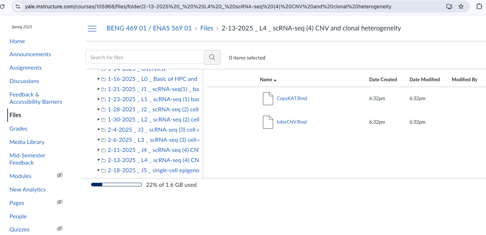

# BENG 469 Lab session 4 - instructions

In this computational lab, we will go through examples of calculating single cell copy number profiles from 10X single cell RNA data, predicting tumor and normal cells, and inferring tumor subclones from using [CopyKAT](https://github.com/navinlabcode/copykat) and [InferCNV](https://github.com/broadinstitute/inferCNV/wiki). We will try to replicate the results presented in Figure 2a and 2c from the [Paper](https://www.nature.com/articles/s41587-020-00795-2) discussed this Tuesday.

### Pre-lab task:
(Estimated completion time: 3 mins)
1. Download "CopyKAT.Rmd", "InferCNV.Rmd" under 2-13-2025_L4_scRNA-seq(4) CNV and clonal heterogeneity/ from Files on Canvas.


2.Upload the files to your project folder on HPC:
Open McCleary OnDemand at [beng469.ycrc.yale.edu](https://beng469.ycrc.yale.edu)  in a browser window, and go to **Files** menu and click open your project folder (/gpfs/gibbs/project/beng469/beng469_YourNetID). 

Then create a new directory called "**Lab4**" and upload the files ("CopyKAT.Rmd", "InferCNV.Rmd") under this new directory.

### During the lab session (Thursday):


1. Go to [beng469.ycrc.yale.edu](https://beng469.ycrc.yale.edu) in your web browser (make sure that you are on Yale Secure Network or Yale VPN).
2. Copy codes and datasets:
```
cp -r /gpfs/gibbs/project/beng469/beng469_my393/Lab4/ ~/project
```
3. Launch an Rstudio-server session:
Go to the Rstudio-server initialization page, and specify the parameters/resources as follows:

| Parameters      | Values |
| ----------- | ----------- |
| R version      | R/4.2.0-foss-2020b       |
| Number of hours   | 6        |
| Number of CPU cores per node   | 4        |
| Memory per CPU core in GiB   | 10       |
| Partitions   | day       |
| Additional modules (optional)  | JAGS/4.3.0-foss-2020b   |

Then click Launch to launch an Rstudio session, and connect the Rstudio session once it’s started
  

#### 5. Open both 'CopyKAT.Rmd' and 'InferCNV.Rmd' by clicking on them.

--- 

### CopyKAT Analysis Workflow

<p></p>

#### Input Data

-Begins with a gene expression matrix derived from unique molecular identifier (UMI) counts from single-cell RNA sequencing (scRNA-seq).

#### Data Preprocessing

- Genes are organized by genomic coordinates.
- Variance is stabilized using Freeman-Tukey transformation.
- Outliers in UMI counts are smoothed using polynomial dynamic linear modeling (DLM).

#### Identification of Diploid Cells

- Identify a subset of diploid cells as a baseline.
- Achieved by grouping single cells into hierarchical clusters.
- Gaussian mixture modeling (GMM) estimates variance within clusters.
- Cluster with the lowest variance is labeled as 'confident diploid cells.'
- Special 'GMM definition' mode for challenging cases.

#### Chromosome Breakpoint Detection

- Utilizes a Poisson-gamma model and Markov chain Monte Carlo (MCMC) iterations.
- Calculate posterior means for gene windows.
- Apply Kolmogorov-Smirnov (KS) tests to join adjacent windows with no significant mean differences.

#### Copy Number Calculation

- Calculate copy number values for each window as posterior averages across genes spanning adjacent chromosome breakpoints.
- Convert copy number values from gene space to genomic positions.
- Achieve genome-wide copy number profiles for each single cell at an approximate resolution of 5 Mb.

#### Clonal Subpopulation Identification

- Apply hierarchical clustering to single-cell copy number data.
- Identify the largest distance between aneuploid tumor cells and diploid stromal cells.
- If genomic distance is not significant, switch to the GMM definition model to predict single tumor cells individually.
- Cluster single-cell copy number data to identify clonal subpopulations.
- Generate consensus profiles representing subclonal genotypes for further analysis of gene expression differences.


---


